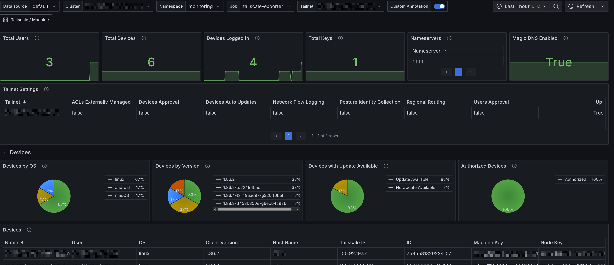

# Tailscale Exporter

A Prometheus exporter for Tailscale that provides tailnet-level metrics using the Tailscale API.

This repository also contains the `tailscale-mixin` that provides Prometheus alerts and rules and Grafana dashboard for tailnet-level metrics. You can find the dashboards in `./tailscale-mixin/dashboards_out/`.

The `tailscale-mixin` also has dashboards and alerts for client side `machine` metrics. You can find the dashboards in `./tailscale-mixin/dashboards_out/`. Jump to the [Client Side Machine Metrics](#client-side-machine-metrics) section for more information.



## Features

- **Comprehensive Device Metrics**: Detailed per-device metrics
- **API Key Management**: Metrics for all API keys
- **DNS Configuration**: DNS settings
- **User Management**: User metrics
- **Tailnet Settings**: Tailnet Configuration
- **API Health**: Monitoring of Tailscale API accessibility

## Authentication Setup

### 1. Generate API Access Token

1. Go to the [Tailscale admin console](https://login.tailscale.com/admin/settings/keys)
2. Navigate to **Settings** → **Oauth Client**
3. Click on **Create new OAuth client**
4. Add read access for DNS, Devices, Users, and Keys
5. Copy the generated token (it's only shown once)

## Installation

### Binary

Download the latest binary for Linux (amd64):

```bash
curl -L https://github.com/adinhodovic/tailscale-exporter/releases/latest/download/tailscale-exporter-linux-amd64 -o tailscale-exporter
chmod +x tailscale-exporter
```

Set up your Tailscale OAuth credentials and tailnet name (replace the placeholders with your actual values):

```bash
export TAILSCALE_OAUTH_CLIENT_ID="your-client-id"
export TAILSCALE_OAUTH_CLIENT_SECRET="your-client-secret"
export TAILSCALE_TAILNET="example.com"   # e.g. "mycompany.com" or "mytailnet.ts.net"
```

Run the exporter:

```bash
./tailscale-exporter
```

### Docker Image

There's a Docker image available on Docker Hub: [tailscale-exporter](https://hub.docker.com/r/adinhodovic/tailscale-exporter).

### Helm

A Helm chart is available in the `charts/tailscale-exporter` directory. You can install it using Helm:

```bash
helm install tailscale-exporter ./charts/tailscale-exporter \
  --set env.TAILSCALE_OAUTH_CLIENT_ID="your-client-id" \
  --set env.TAILSCALE_OAUTH_CLIENT_SECRET="your-client-secret" \
  --set env.TAILSCALE_TAILNET="your-tailnet-name"
```

## Usage

### Environment Variables

Set the required environment variables:

```bash
export TAILSCALE_OAUTH_CLIENT_ID="your-client-id"
export TAILSCALE_OAUTH_CLIENT_SECRET="your-client-secret"
export TAILSCALE_TAILNET="your-tailnet-name"
```

### Basic Usage

```bash
./tailscale-exporter
```

The exporter will start on port 9250 by default and expose metrics at `/metrics`.

### Command Line Options

```bash
./tailscale-exporter -h

Flags:
  -h, --help                         help for tailscale-exporter
  -l, --listen-address string        Address to listen on for web interface and telemetry (default ":9250")
  -m, --metrics-path string          Path under which to expose metrics (default "/metrics")
      --oauth-client-id string       OAuth client ID (can also be set via TAILSCALE_OAUTH_CLIENT_ID environment variable)
      --oauth-client-secret string   OAuth client secret (can also be set via TAILSCALE_OAUTH_CLIENT_SECRET environment variable)
  -t, --tailnet string               Tailscale tailnet (can also be set via TAILSCALE_TAILNET environment variable)
```


## Prometheus Configuration

Add the following to your `prometheus.yml`:

```yaml
scrape_configs:
  - job_name: 'tailscale-exporter'
    static_configs:
      - targets: ['localhost:9250']
    scrape_interval: 30s
    metrics_path: /metrics
```

## Metrics

You can find the full list of metrics in the [METRICS.md](./docs/METRICS.md) file.

### Client Side Machine Metrics

This project also makes use of the [Tailscale's client side metrics](https://tailscale.com/kb/1211/client-metrics/) that are exposed by Tailscale clients. These metrics provide insights into individual devices connected to your tailnet.

The dashboards and alerts depend on the `tailscale_machine` label to exist, it makes filtering and grouping the metrics easier. Adding the label is fairly straightforward using Prometheus' `relabel_configs`. Here's an example configuration using the `ServiceMonitor` spec:

```yaml
spec:
  relabelings:
  - action: replace
    replacement: adin
    targetLabel: tailscale_machine
```
